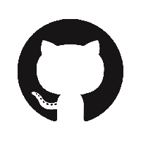

## Welkom op de portfoliopagina van Renske Maas!
Ik ben Renske Maas, 20 jaar en ik studeer Communication and Multimedia Design op Zuyd Hogeschool in Maastricht. Ik geniet ervan als ik creatief bezig kan zijn; digitaal en analoog. Ook kan ik erg genieten van gamen, lezen en wandelen.

Dit ben ik: 

Op deze pagina vind je een aantal opdrachten en projecten die ik heb gemaakt.

<ul>
  <a href="http://student-1929712maas.mamdt.com/11-whole-task/"><li>Wholetask blok 1</li></a>
  <a href="http://student-1929712maas.mamdt.com/12-whole-task/pitch.pdf"><li>Wholetask blok 2</li></a>
  <a href="https://renskecjmaas.github.io/MMT4-les3-opdracht5/"><li>Opdracht javascript website Blok 4</li></a>
</ul>

